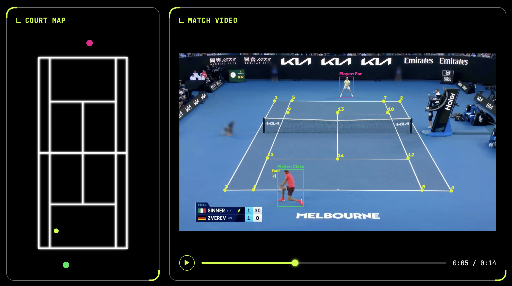
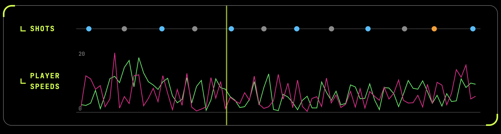
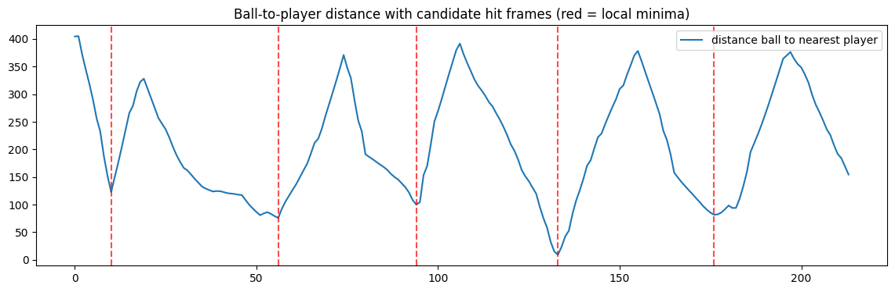

# CourtHawk

Computer vision system for tennis that detects and tracks players and ball, estimates player poses, classifies shots, detects court geometry, and projects movements onto a bird's-eye-view using homography.

This project is inspired by [this tutorial](https://www.youtube.com/watch?v=L23oIHZE14w). It has since been substantially expanded and reworked, with significant improvements to the code structure, system architecture, and computer vision methods.

To Do: Continue building the frontend, deploy it, Heatmap regression models to replace current ball tracking and court keypoints.

<p align="center">
  
</p>

<p align="center">
  
</p>


## How It Works

The below is an analysis on how the system works when we run `python3 -m courthawk-engine.main`. The system works very similarly on the web app, except that only the bounding boxes and court keypoints are overlayed onto the video. The mini-court and statistics are displayed elsewhere on the frontend. However, the mathematical logic remains the same.

---

### Input

As input, CourtHawk expects a video from the standard TV angle of 1 tennis point starting from the moment the server hits the ball and ending as soon as the point finishes (Currently working on a method to accept an entire tennis match and determining how to split up points). Both tennis players should be visible from the very first frame. The court geometry is assumed to be constant during the duration of the video because the system only runs inference on the court keypoint model using a few arbitrary frames. 

---

### Player Tracker

#### Persons Detection

Player tracking is done by a pretrained `YOLOv8x` model. The model is directed to only track the "person" class (index 0). The player detections are returned as bounding boxes for every frame. A bounding box is defined using 2 points: The top-left point and the bottom-right point.

#### Player Selection

The ball boys and chair umpire are likely to also be tracked by the model, so to select the actual players, we score every detected "person" using a weighted combination of 2 terms: the sum of the Euclidean distances from their foot position to their nearest 3 court keypoints, and the euclidean distance from their foot position to the nearest center hash mark. The 2 persons with the lowest score are selected as the players.

$$\text{score} = \gamma \cdot (\alpha \cdot (\text{sum of distances to nearest 3 keypoints}) + \beta \cdot (\text{distance to nearest center hash mark}))$$

with $\alpha = 0.2$ and $\beta = 0.8$ by default. The $\gamma$ parameter is 0.5 if the player is on the close side of the court and 1 otherwise. The sum of the Eucliden distances from the nearest 3 court keypoints provides a good measure of approxiamately how close a person is to the court. The distance to the nearest center hash mark is used to filter out ball boys and the chair umpire who might also be near the court. The $\gamma$ term is used because player selection occurs from the original TV-angle, and thus a fixed real-world distance corresponds to more pixels on the near side of the court than on the far side. The $\gamma$ term is important for ensuring ball boys on the far side of the court are not chosen as players.

#### Interpolating Missing Detections

There is a chance the model fails to detect the players during certain frames. To ensure this doesn't crash any computations, missing detections are linearly interpolated between the nearest known detections. Any remaining missing detections at the beginning or end of the video are backward-filled or forward-filled, respectively.

---

### Ball Tracker

#### Ball Detection and Training

Ball tracking is done by a fine-tuned `YOLOv5` model. The model is fine-tuned with a public dataset from RoboFlow consisting of 428 training set images, 100 validation set images, and 50 test set images, all containing corresponding bounding boxes for the tennis balls. The dataset can be accessed at: [RoboFlow Ball Detection Dataset](https://universe.roboflow.com/viren-dhanwani/tennis-ball-detection/dataset/6). The model is restriced to track only 1 tennis ball. 

#### Limitations and Potential Improvement: Heatmap Regression

Since the ball moves at a very high speed and is frequently blocked by players, missing detections are also linearly interpolated between the nearest known detections. Any remaining missing detections at the beginning or end of the video are backward-filled or forward-filled.

Currently working replacing YOLO for ball tracking and instead adapting a model that produces a heatmap of the ball's location over the entire image (model would be analogous to a semantic segmentation model).

---

### Court Keypoints

#### Keypoint Detection and Training

Court keypoint detection is done using a fine-tuned `ResNet-18` model. The model is fine-tuned with a public dataset consisting of 8841 images, separated into 75% training and 25% validation. The dataset can be accessed at: [Tennis Court Detector GitHub](https://github.com/yastrebksv/TennisCourtDetector). The model is trained to predict 28 independent values, corresponding to the 14 keypoints on a court. Thus, this task is treated as regression.

#### Keypoint Refinement

For each predicted keypoint, a crop is made around it, centered about the prediction. From the crop, we threshold the image to find bright pixels and apply the Probabilistic Hough Transform to detect line segments. Duplicated line segments within a distance threshold on both ends are merged together. If only 2 line segments remain, we compute their intersection, and if it exists, we replace the prediction with the intersections. If any of the conditions fail, we keep the original prediction.

The court keypoint locations stay constant during the duration of the video. So, we compute the court keypoints for a few random frames and average their result as the final keypoints.

#### Potential Improvement: Heatmap Regression

A better method to consider is to instead use a model that predicts 14 heatmaps, one for each keypoint. This way, we are not predicting 28 independent values. Something important to consider is to not have only the ball pixels have value 1 and all other pixels have value 0. The Gaussian heatmap value at pixel $(x, y)$, with the true keypoint at $(x_k, y_k)$ is given by 

$$H(x, y) = \exp(- \frac{(x - x_k)^2 + (y - y_k)^2}{2 \sigma^2})$$

where $\sigma$ determines how spread out the distribution is. The distribution depends on the value of $\sigma$, but an example distribution is 

$$
\begin{bmatrix}
0.00 & 0.01 & 0.04 & 0.01 & 0.00 \\
0.01 & 0.14 & 0.37 & 0.14 & 0.01 \\
0.04 & 0.37 & 1.00 & 0.37 & 0.04 \\
0.01 & 0.14 & 0.37 & 0.14 & 0.01 \\
0.00 & 0.01 & 0.04 & 0.01 & 0.00
\end{bmatrix}
$$

---

### Mini-Court

The minicourt provides a bird-eye's view of the point. The player and ball positions are approxiamated since it is impossible to determine the height of the tennis ball given only a single angle of the point. 

#### Homography

We first extract the foot position of the players and the center position of the ball on the actual court. To translate the positions onto minicourt, we calculate the homography. The homography is a matrix $H \in \mathbb{R}^{3 \times 3}$ that maps points from the original image plane to corresponding points on the mini-court plane. The homography requires at least 4 points to calculate as it has 8 degrees of freedom.

```math
\begin{bmatrix}
x_{\text{mini}} \\
y_{\text{mini}} \\
1
\end{bmatrix}
\sim
\begin{bmatrix}
x' \\
y' \\
z'
\end{bmatrix}
=
\begin{bmatrix}
h_1 & h_2 & h_3 \\
h_4 & h_5 & h_6 \\
h_7 & h_8 & h_9
\end{bmatrix}
\begin{bmatrix}
x \\
y \\
1
\end{bmatrix}
```

---

### Shot Detection

To detect when a shot occurs, we start by graphing the minimum distance between the ball and either player over time. When a player hits the ball, this distance should briefly approach a minimum before increasing as the ball travels toward their opponent. Therefore, local minima in the distance curve are treated as potential shots.

To reduce false detections caused by noise in the ball and player tracking, we restrict the minimum time between consecutive shots and the prominence of each local minimum. This filters out small fluctuations that are unlikely to be actual shots.

<p align="center">
  
</p>

---

### Shot Classification

#### Pose Estimation

When we detected the shots using the algorithm above, we also determined which player hit the ball. Since we have the bounding boxes of the player across all the frames, we can crop out the player in the frames near the shot frame (specifically we crop out the player in 7 frames $[\text{shot frame} - 3, \text{shot frame} + 3]$). 

For each cropped frame, we run MediaPipe's Pose Estimation model. MediaPipe detects 33 body landmarks, including the shoulders, elbows, wrists, hips, knees, and ankles. Each landmark contains an estimated $(x, y)$ position.

#### Feature Vector Extraction

Rather than use the landmark positions directly, we extract a smaller set of features relevant to tennis that describe the players pose. The positions are centered at the players mid-shoulder position and then normalized by their torso length so that the representation is less sensitive to the player's size or distance from camera. Below is a list of all the features extracted.

1. Max wrist height: Higher of two wrists relative to the mid-shoulder. Expectation is that the value is greater for a serve and lower for forehands and backhands.
2. Left elbow angle: wrist -> elbow -> shoulder. Expectation is greater angle for serves compared to groundstrokes.
3. Right elbow angle: wrist -> elbow -> shoulder. Expectation is greater angle for serves compared to groundstrokes.
4. Shoulder tilt: Angle of the shoulder line relative to the horizontal. Expectation is greater angle for serves compared to groundstrokes. 
5. Torso lean: Angle of the mid-shoulder to mid-hip relative to the vertical.
6. Left wrist x-position: Expect positive for forehands, negative for backhands, and near 0 for serves.
7. Right wrist x-position: Expect positive for forehands, negative for backhands, and near 0 for serves.
8. Left wrist y-position: Expect higher for serve, lower for groundstrokes.
9. Right wrist y-position: Expect higher for serve, lower for groundstrokes.
10. Left arm extension: Norm of vector from left shoulder to left wrist.
11. Right arm extension: Norm of vector from right shoulder to right wrist.
12. Left elbow x-position: Same reasoning as left wrist x-position
13. Right elbow x-position: Same reasoning as right wrist x-position
14. Signed wrist separation: Expect largest separation magnitude for forehands and lowest separation magnitude for backhands.

#### Softmax/Multinomial Logistic Regression

The extracted feature vector is used to train a `Softmax/Multinomial Logistic Regression` model to classify shots for 3 classes: forehand, backhand, and serve. The training dataset was extracted from videos by hand. The system applies the model for all 7 frames and decides by a majority vote.

#### Potential Improvement: Real-ESRGAN Image Upscaling

Due to the small size of players, the cropped box contains a very low quality image, making it difficult for MediaPipe to determine the 33 landmarks. We should consider using methods like Real-ESRGAN to upscale the images before inference. Additionally, we should consider training 2 separate models for the players on the 2 sides of the court. 

---

### Speed Statistics

For each player, we keep track of 2 statistics:
- Last Shot Speed
- Player Current Speed

The last shot speed is calculated by using when the player last hit the ball as a start frame and a few frames later as the end frame. We can calculated the speed of the shot using $s_{avg} = \frac{\Delta d}{\Delta t}$ from start frame to end frame. The player current speed is calculated every few frames using the same formula.

---

### Output

Running `courthawk_engine/main.py` will produce a video with all of the above overlayed on the orginal video. When running the system using the deployed app (coming soon), the results will be displayed next to the video.

## File Structure

```
CourtHawk/
├── courthawk_engine/
│   ├── core/                        # Video I/O, Data Structures, Unit Conversions, Constants
│   ├── court_keypoint_detector/     # Predicts and refines court keypoints
│   ├── trackers/                    # YOLOv8 player tracking, YOLOv5 ball tracking
│   ├── minicourt/                   # Mini-court overlay, homography, shot/speed stats
│   ├── pose_estimation/             # MediaPipe pose extraction and shot classification
│   ├── renderer/                    # Draws tracking/stat overlays back onto the video
│   ├── models/                      # Trained model weights (gitignored)
│   ├── data/                        # Input/output videos and training data (gitignored, except input/output videos)
│   ├── stubs/                       # Cached detection results (pickle) to skip re-inference for testing
│   ├── development/                 # Notebooks used to build and prototype the pipeline
│   ├── engine.py                    # Public API entry point used by the backend
│   └── main.py                      # Standalone script to run the full pipeline for testing
│
├── backend/                         # API layer (in progress)
└── frontend/                        # UI layer (in progress)
```
