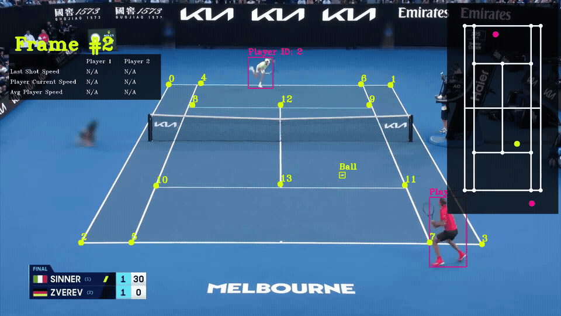

# CourtHawk: Computer Vision for Tennis Analytics



CourtHawk is a computer vision system for analyzing tennis footage, tracking players and the ball, detecting and classifying shot types, and overlaying stats on a mini-court diagram.

## Overview

Given a raw match video from the standard angle, the pipeline:
1. Detects and tracks both players and the ball across every frame
2. Identifies court keypoints and maps the court to a mini-court view
3. Detects frames where the ball is struck
4. Classifies each shot as a forehand, backhand, or serve using pose estimation
5. Computes ball speed and player movement speed
6. Renders all of the above back onto the original video

## Machine Learning Models

| Model | Purpose |
|---|---|
| YOLOv8x | Detects and tracks players frame-by-frame. |
| YOLOv5 (fine-tuned) | Detects the tennis ball (fine-tuned on tennis ball dataset). Results are not perfect due to the high speed of the ball. |
| ResNet-18 Court Keypoint Model (find-tuned) | Predicts 14 court keypoints used to build the homography for the mini-court. |
| MediaPipe Pose Landmarker | Estimates 33-point body pose on cropped player images. Results are not perfect due to the low quality of the video and high speed of player movements |
| XGBoost Classifier | Classifies pose features into forehand / backhand / serve using outputs from MediaPipe Pose Landmarker. |

## Shot Classification

For each detected ball strike, the pipeline samples up to 7 frames (+ and - 3 around the hit frame), crops the hitting player out of each, and runs MediaPipe pose estimation on the crop. 16 geometric features are extracted from the landmarks (wrist heights, elbow angles, shoulder/hip rotation, torso lean, etc.) and fed to an XGBoost model. The final shot type is decided by majority vote across the 7 frames or labeled as “unknown” if pose landmarks cannot be detected by MediaPipe in any of the 7 frames.

See `pose_estimation/features.txt` for the full feature list.

## File Structure (Not Updated Yet)

```
tennis-cv-analysis/
├── main.py                          # Entry point: runs the whole system and produce outputs
│
├── trackers/
│   ├── player_tracker.py            # YOLOv8 player detection, tracking, and bbox drawing
│   └── ball_tracker.py              # YOLOv5 ball detection, interpolation, and shot frame detection
│
├── court_line_detector/
│   └── court_line_detector.py       # Predicts court keypoints, refines with line intersection, averages across frames
│
├── court_dimension_constants/
│   └── __init__.py                  # Real-world court dimensions in metres
│
├── minicourt/
│   └── minicourt.py                 # Draws the mini-court overlay, computes homography, calculates shot and speed stats using movements in the mini-court
│
├── pose_estimation/
│   ├── pose_estimator.py            # MediaPipe pose extraction, feature computation, shot classification with voting
│   ├── shot_classifier.py           # Wrapper around the XGBoost pickle file for inference
│   ├── features.txt                 # Documentation of all 16 pose features
│   ├── train.ipynb                  # Trains the XGBoost shot classifier from labeled images
│   ├── pose_test.ipynb              # Visualises MediaPipe pose detection on a single image
│
├── input-videos/                    # Raw input footage
├── output-videos/                   # Output videos with overlay
├── tracker_stubs/                   # Cached detection results (pickle) to skip re-inference
└── training/                        # Training data and configs
```
